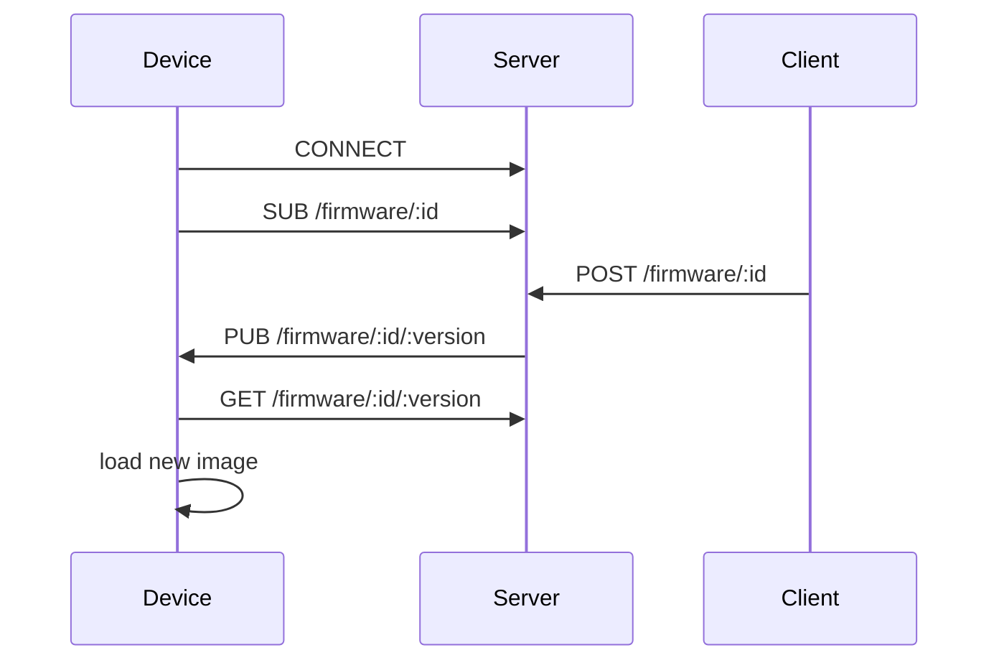
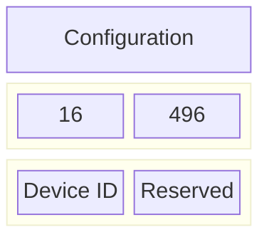
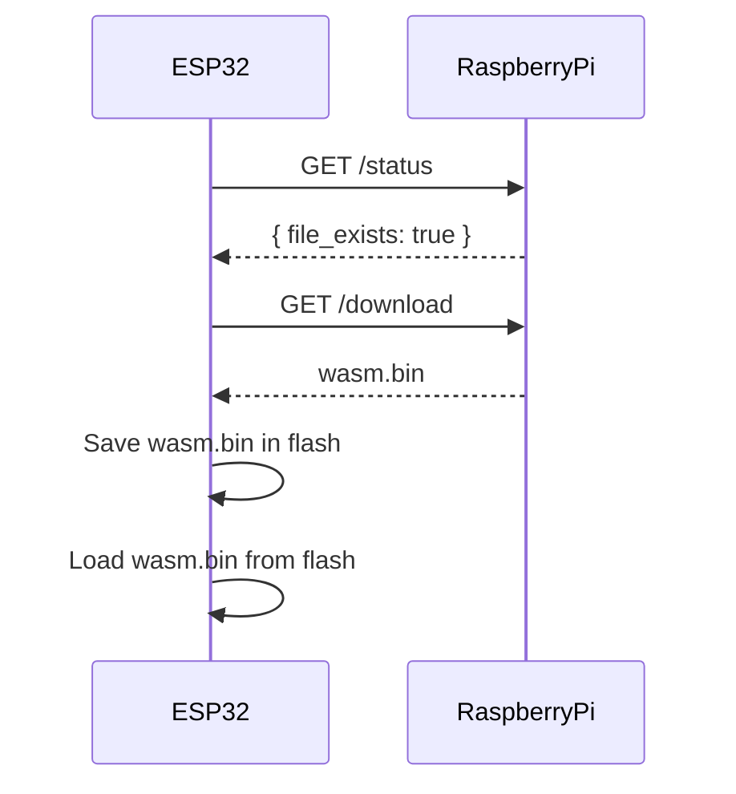

# xtblish MVP

## WASM Firmware Deploy Flow

The current behaviour:

## WASM Firmware Binary

The firmware binary is made of:

## Provisioning

Provide an identity to a device and OTP a few things.

# xtblish Proof of Concept (PoC)

## Introduction

The idea behind this project is to provide the following advantages over more tradicional setups:

* Program in more than C: AssemblyScript, Rust, C++ or more. With close to native speed.
* Use any microcontroller (with external Flash and RAM) support.
* Grant access to builtin Zephyr libraries in a higher level application.

Essentially, I wanted to create a better [ElectricImp](https://www.electricimp.com).

* No longer locked into a specific MCU.
* No longer locked to use a dinamically typed language (as Squirrel).
* No longer locked to a millisecond resolution application.

WebAssembly (WASM) is a very promising technology. With the correct setup is
possible to provide cloud debugging (due to DWARF) on the browser.

## In this repository

The following chart is what I wanted to achieve:

A application is created out of a wasm.bin file that exist in a flash partition.
A new file exists, and the ESP32 fetches it from a server.
The file is then saved into flash and loaded again by the runtime.

This was worked fine, but have raised a few concerns:

* Memory used: ESP32 is not known for being light, but WiFi has consumed too much heap.
* In-system vs external RAM: a few issues were encountered, specially when dealing with WiFi blobs. In the future, it will probably be better to define a heap region only from the PSRAM and let the internal be used for the runtime.
